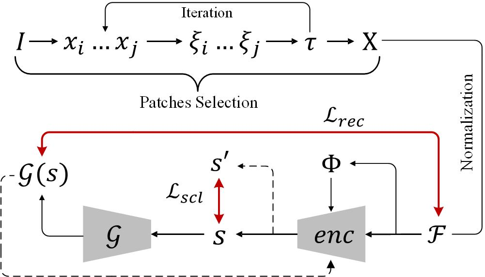
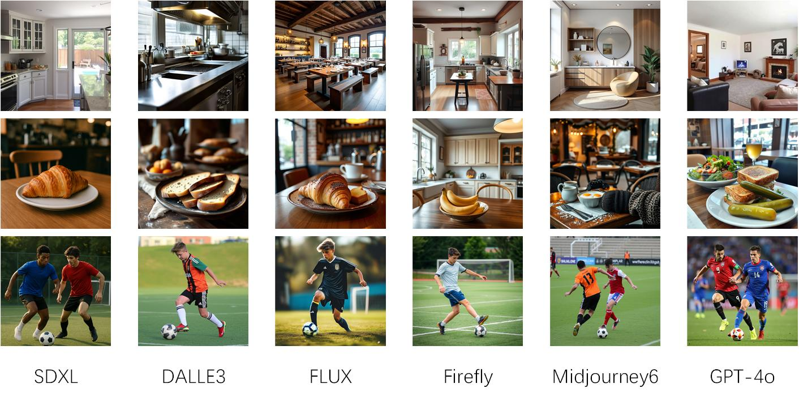

# Secrets Lie in Smooth Patches: Synthetic Image Detection with Generator-Agnostic Pixel Fluctuations

An implementation code for paper "Secrets Lie in Smooth Patches: Synthetic Image Detection with Generator-Agnostic Pixel Fluctuations"


## Table of Contents

- [Background](#background)
- [Datasets](#datasets)
- [Dependency](#dependency)
- [Usage](#usage)
- [Acknowledgments](#acknowledgments)


## SLSP

With the proliferation of powerful image generative models, accurately and robustly detecting synthetic images has become an increasingly challenging and important problem. Recent detection approaches often overfit to specific generators or dataset artifacts, limiting their generalizability. Our work revisits the fundamental statistical differences between real and generated images, focusing on the subtle stochastic pixel fluctuations that are inherently present in real photographs but largely missing or over-smoothed in synthetic ones.

We propose Training-Free Skeptical Over-Smooth Region (TrSOR) Selection—a principled, generator-agnostic patch selection algorithm that identifies highly smooth, fluctuation-sensitive regions in an image via a statistical thresholding procedure based on local gradient energy. We then design a lightweight self-supervised pipeline to encode and reconstruct these patches, enabling generator-agnostic synthetic image detection without the need for any fake images during training.

<p align='center'>  
  
</p>

<p align='center'>  
  <em>An overview of our architecture. Top: the first step to select Skeptical Over-Smooth Region by iterative estimation. Bottom: thesecond step to self-encode the fluctuations viaa bottleneck paradigm fashion.
</em>
</p>

## Datasets
<p align='center'>  
  
</p>


Some examples of generated images in our Benchmark


## Dependency

### Environment Setup
We recommend using Anaconda to set up the environment:

``` bash
conda install pytorch==1.13.1 torchvision pytorch-cuda=11.7 -c pytorch -c nvidia -y
yes | pip install mmcv-full==1.7.0 -f https://download.openmmlab.com/mmcv/dist/cu117/torch1.13/index.html
conda install scipy -c conda-forge -y
yes | pip install mmcls==0.23.2
yes | pip install mmdet==2.25.1
yes | pip install git+https://github.com/facebookresearch/detectron2.git
yes | pip install wandb
```
### Data Preparation
The resulting directory structure should be as follows:

``` bash
├── configs
├── data
│   ├── VS-COCO
│   │   ├── annotations
|   │   │   ├── panoptic_train2017
|   │   │   ├── panoptic_val2017
│   │   ├── train2017
│   │   └── val2017
│   │   └── VS-COCO.json
│   ├── ...
├── pretrain
├── agbigt
├── scripts
├── tools
│   ├── train.py
│   ├── test.py
├── work_dirs
├── ...
```

## Usage

### Training

```bash
#single GPU
PYTHONPATH='.':$PYTHONPATH python configs/mask2former/agbigt.py

#multi GPU
PYTHONPATH='.':$PYTHONPATH bash tools/dist_train.sh configs/mask2former/agbigt.py 4
```

### Testing

```bash
PYTHONPATH='.':$PYTHONPATH \
python tools/test.py \
    configs/deformable_detr/od_r101_coco.py \
    pretrain/deformable_detr_r101_coco.pth \
```

## Acknowledgments

Ag-BiGT is developed based on [MMDetection](https://github.com/open-mmlab/mmdetection) and [STIP](https://github.com/zyong812/STIP). We sincerely appreciate the efforts of the developers from the previous codebase.

